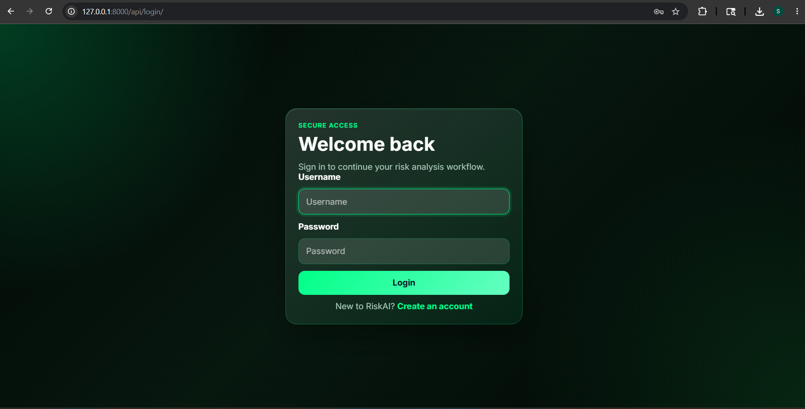
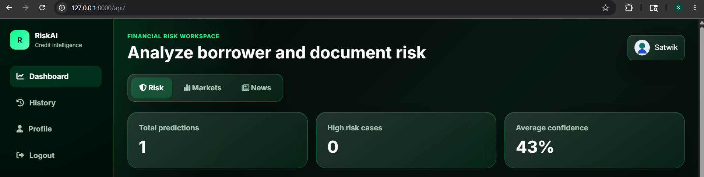
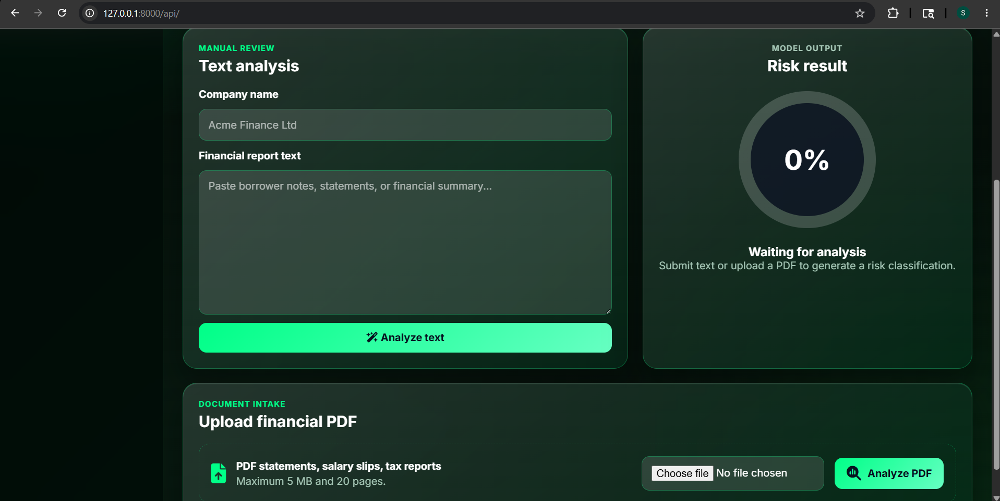

# 🚀 AI Contract Analyzer

An AI-powered web application that analyzes legal contracts and detects potential risks using Natural Language Processing (NLP) and Machine Learning.

---

## 📌 Overview

This project allows users to upload contract documents and automatically:
- Extract key information
- Classify clauses
- Detect risk levels
- Generate summaries

Built as a full-stack AI system combining backend development and ML models.

---

## ✨ Features

- 📄 Upload and analyze contract PDFs
- 🧠 AI-based clause classification
- ⚠️ Risk prediction (High / Medium / Low)
- 🏷️ Named Entity Recognition (NER)
- ✂️ Automatic contract summarization
- 🔐 User authentication system
- 📊 Dashboard for results visualization

---

## 🛠️ Tech Stack

**Backend**
- Django
- Django REST Framework

**AI / ML**
- Scikit-learn
- spaCy
- Transformers (Hugging Face)

**Other Tools**
- Python
- SQLite / MySQL
- Git & GitHub

---

## ⚙️ How It Works

1. User uploads a contract PDF  
2. Text is extracted using NLP techniques  
3. AI models analyze the text:
   - Identify clauses  
   - Detect risks  
   - Extract entities  
   - Generate summary  
4. Results are displayed in the dashboard  

---

## 📸 Screenshots

### 🔐 Login Page


### 📊 Dashboard Overview


### 🧠 Contract Analysis & Risk Output


---

## 💻 Setup Instructions

```bash
git clone https://github.com/satwiksahu320/AI-Contract-Analyzer.git
cd AI-Contract-Analyzer
pip install -r requirements.txt
python manage.py runserver
```

## 👨‍💻 Contribution

This project was developed as a team collaboration.

- **My Role (AI/ML):**
  - Built and trained machine learning models for risk prediction
  - Implemented NLP pipeline (text extraction, preprocessing)
  - Integrated models into backend APIs
  - Worked on text classification and risk scoring logic

- **Teammate Role (Backend):**
  - Backend development using Django
  - API design and database management
  - Authentication system and dashboard UI

**Teammate:** [Om Prakash Pani](https://github.com/omprakashpani)
